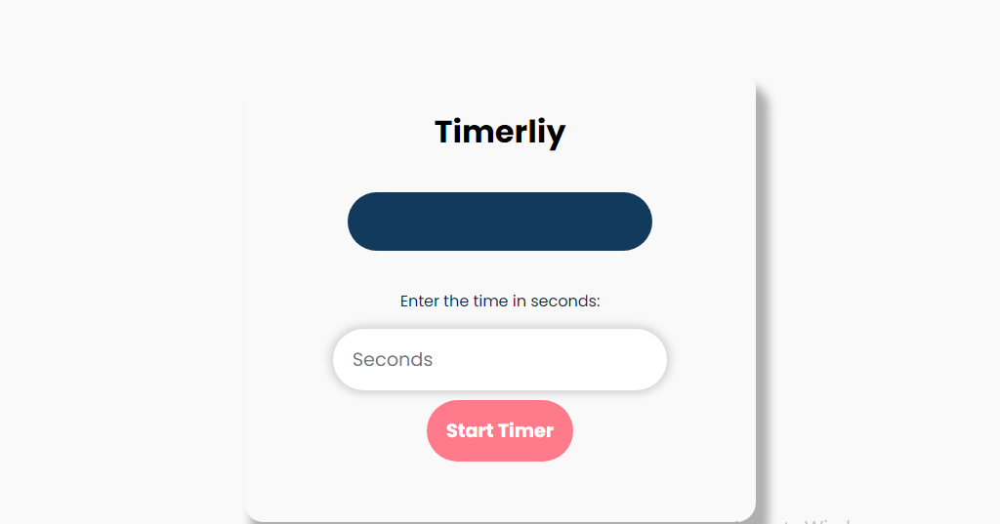

# timerliy
 

Explore the simplicity and functionality of our Timer Website, designed to meet your timing needs with ease and precision. Whether you need a timer for productivity, cooking, workouts, or any timed activity, our intuitive platform is ready to assist you.

  
 

User-Friendly Interface: Our timer is built for simplicity and ease of use. With a clean and intuitive design, setting and managing your time has never been easier.

Customizable Timers: Set your timer to any duration you need. Whether it's a quick 5-minute break or a 2-hour study session, you can easily adjust the timer to fit your schedule.

Start, Pause, and Reset Functions: Control your timer with straightforward start, pause, and reset buttons. This allows for flexibility, letting you pause and resume as needed.

Visual and Audio Alerts: Get notified with both visual and audio signals when your timer hits zero. This feature ensures you won’t miss the end of your timed session, no matter what you’re doing.

Multiple Timer Support: Run multiple timers simultaneously. Perfect for managing different tasks or activities at the same time without any confusion.

Responsive Design: Our website is fully responsive, ensuring a seamless experience across all devices—be it your desktop, tablet, or smartphone. Take your timer with you wherever you go!

Dark Mode: Switch to dark mode for a comfortable viewing experience in low-light environments. This feature reduces eye strain and adds a sleek look to your timing tasks.

 
author : <b>Muhammad Hussain Shamim</b>
